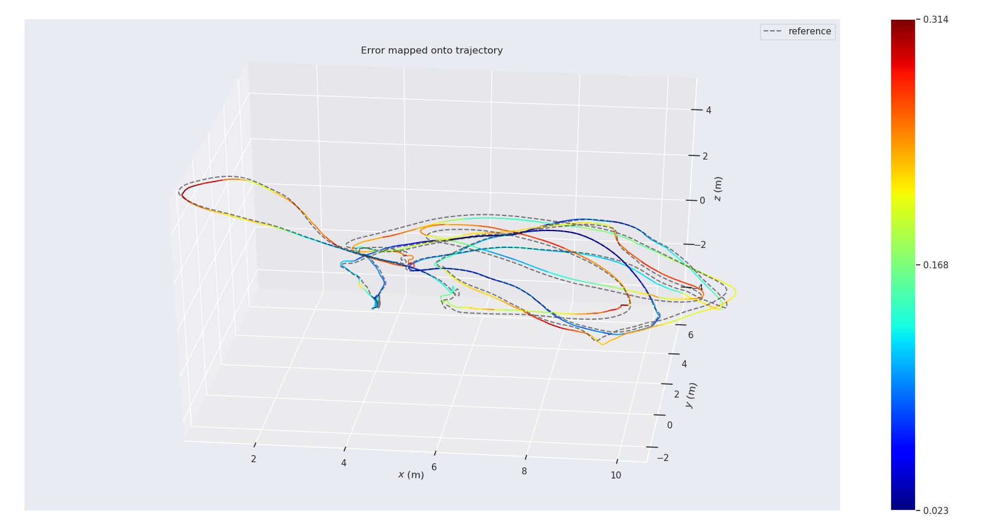

# Mono msckf

## image process
1. refers to VINS-Mono's image process.
2. uses grid cell to splits points.

&nbsp;
----

## MSCKF
1. convert quaternion conversion from JPL to Hamilton;


&nbsp;
---

## How to use project with ros
1. this project has some requirements
	a. glog
	b. gflags
	c. opencv
	d. absl(google)
	e. SuiteSparse
	f. eigen
	g. boost

2. when use ROS with this project, you can use this command to compiler project
```
catkin_make --pkg learn_msckf --cmake-args -DBUILD_TEST=OFF -DBUILD_DEBUG=OFF
```
3. use roslaunch to run the msckf_node
```
roslaunch learn_msckf demo_mono_msckf.launch
```
4. play the rosbag of euroc
```
rosbag play MH_03_medium.bag
```

&nbsp;
---

## How to use project with testing sources
1. use the command below to compiler testing
```
catkin_make --pkg learn_msckf --cmake-args -DBUILD_TEST=ON -DBUILD_DEBUG=OFF
```
2. cd to binary output directory and run with those arguments
```
./system_test --config_path ${HOME}/catkin_ws/src/learn_msckf/config/config.yaml --dataset_name euroc --dataset_path ${HOME}/Documents/DATA/VSLAM/zip/MH_03_medium/mav0
```
Here:	
1. config_path indicates config file's path;
2. dataset_name indicates dataset's name, only support euroc currently;
3. dataset_path indicates dataset's directory;

3. there are several test case the testing directory, if you want to build and test, change the file name from "xxx_test1.cc" to "xxx_test.cc" and recompiler

&nbsp;
----

## Result


&nbsp;
-----

## TODO list
- ~~change Feature initial Pose from XYZ method to inverse depth method, this may improves the performance.~~
- use IEKF in measurements update.
- add RELOCAL?

&nbsp;
----

## Summary
1. initial is very important for system, but it's simpler than VINS-Mono.
2. feature initial's precious also very important.
3. when prune camera buffer, its better when you involve all observations of the valid feature than only use observations belongs to the camera which will be pruned. This improves the performance when the robot is static.